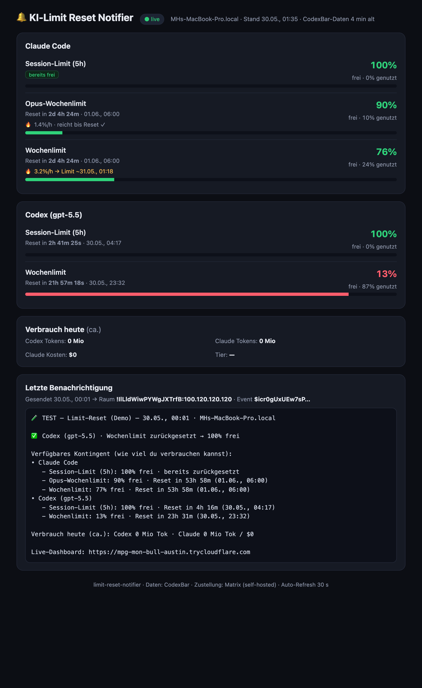

# 🔔 limit-reset-notifier

Tells you **the moment your AI usage limits reset** — sends a Matrix message to your
self‑hosted homeserver and publishes a live **KPI dashboard** (public URL + login) showing
how much quota you have left across **Claude Code** and **OpenAI Codex**.

> Built around [CodexBar](https://github.com/steipete/CodexBar) as the data source and a
> self‑hosted Matrix (Synapse) homeserver as the delivery channel.



---

## What it does

1. **Collects** the current rate‑limit windows for each provider (session / weekly / Opus)
   straight from CodexBar's local history — `usedPercent` + `resetsAt` per window — plus an
   approximate "tokens used today" figure. It also estimates a **burn rate** (recent %/h) and
   projects when each window would be exhausted at the current pace ("reicht bis Reset" vs.
   a concrete time).
2. **Detects a reset**: a window rolled into a new `resetsAt` *and* usage fell back to ~0.
3. **Notifies** you in a dedicated Matrix room: *"✅ Codex Wochenlimit zurückgesetzt → 100 % frei"*
   together with the full picture of how much you can still burn on every provider.
4. **Publishes** a live dashboard to a public URL (Basic‑Auth protected) so you can check
   status from anywhere — **no Tailscale/VPN needed**.

The point of #4: the homeserver itself is only reachable on a private Tailnet. The dashboard
is exposed publicly through a [cloudflared](https://github.com/cloudflare/cloudflared) tunnel,
so it's reachable from any phone/browser while staying behind a login.

## Architecture

```
 ┌──────────── your Mac (data lives here) ─────────────┐      ┌──── NetCup VPS (public-ish) ────┐
 │  CodexBar caches ──▶ src/collect.mjs ──▶ dist/kpi.json│      │  Synapse homeserver (Matrix)    │
 │                       src/detect.mjs  (reset?)        │      │  dashboard/server.mjs  :8799    │
 │                       src/notify-matrix.mjs ──────────┼─────▶│   ▲ Matrix Client-Server API    │
 │                       run.sh  (scp kpi.json) ─────────┼─────▶│   └ data/kpi.json + notify.json │
 │  launchd: every 10 min                                │      │  cloudflared ──▶ public https URL│
 └───────────────────────────────────────────────────────┘      └─────────────────────────────────┘
```

* **Mac** = collector + notifier (has the CodexBar data; reaches the homeserver over Tailscale).
* **VPS** = always‑on public dashboard host + the Matrix homeserver.
* Your real Matrix rooms are never touched — the notifier creates **its own** room on first run.

## Data sources (read‑only, on the Mac)

| Provider | Rate‑limit windows | Consumption |
|---|---|---|
| Claude | `~/Library/Application Support/com.steipete.codexbar/history/claude.json` → `unscoped[]` | `~/Library/Caches/CodexBar/cost-usage/claude-v2.json` |
| Codex  | `…/history/codex.json` → `accounts[preferred][]` | `…/cost-usage/codex-v6.json` |

Each window carries `{ name, windowMinutes, entries:[{capturedAt, resetsAt, usedPercent}] }`.

## Setup

```bash
cp .env.example .env.deploy && $EDITOR .env.deploy   # fill in host, creds, homeserver, dashboard URL
```

### Mac (collector + notifier)

```bash
./run.sh            # one cycle: collect → detect → notify-on-reset → publish
./run.sh --demo     # force a clearly-labelled TEST notification (for proving the pipeline)
```

Schedule it every 10 minutes with launchd:

```bash
cp deploy/com.mh.limit-reset-notifier.plist ~/Library/LaunchAgents/
launchctl bootstrap gui/$(id -u) ~/Library/LaunchAgents/com.mh.limit-reset-notifier.plist
launchctl kickstart -k gui/$(id -u)/com.mh.limit-reset-notifier   # run once now
```

The **Matrix access token** is read from the macOS keychain
(`security find-generic-password -s matrix-archive-sync -a "$USER" -w`) or `$MATRIX_TOKEN` —
it is never written to disk in this repo.

### VPS (public dashboard)

`deploy/vcvm-setup.sh` provisions everything on the host named by `$VCVM_HOST`:

```bash
VCVM_HOST=vcvm bash deploy/vcvm-setup.sh
```

It uploads `dashboard/`, writes `dashboard.env` (chmod 600), installs two systemd services —
`limit-reset-dashboard` (the Node server, bound to `0.0.0.0:$PORT`) and `limit-reset-tunnel`
(cloudflared, `--protocol http2` because UDP/QUIC is blocked here) — and prints the public URL.

Get the current tunnel URL any time:

```bash
bash deploy/tunnel-url.sh        # ssh-es in and greps the journal
```

### Tests

```bash
node --test            # unit tests for the reset-detection core (src/lib/detect-core.mjs)
```

Covers: a genuine reset fires exactly one real event; mid‑window usage increases don't;
a freshly‑rolled-but-still-busy window doesn't; the same reset is never notified twice; and the
burn‑rate / exhaustion‑projection math (`src/lib/burn.mjs`).

## Proof / end‑to‑end evidence

| File | Shows |
|---|---|
| `proof/dashboard-public.png` | the public dashboard (logged in) with live KPIs + the notification |
| `proof/matrix-room.png` | a **live readback** of the notification room straight from the homeserver |
| `proof/last-send.json` | event id + server read‑back of the sent message |
| `proof/matrix-readback.json` | `GET /messages` server response confirming the event is stored |

Public reachability was independently confirmed from outside the Tailnet (the dashboard's
`/healthz` returns `ok` over the public internet).

## Security notes

* The dashboard is **Basic‑Auth** protected; credentials live only in the host's `dashboard.env`
  (mode 600) and in your local `.env.deploy` (gitignored). Change them with
  `systemctl edit`/redeploy.
* cloudflared **quick tunnels are ephemeral** — the `*.trycloudflare.com` URL changes whenever
  the tunnel restarts (e.g. on reboot). `run.sh` **auto-discovers the live URL** at runtime and
  rewrites `.env.deploy`, so Matrix notifications always link the current dashboard. For a fixed
  URL, run a *named* tunnel with your own Cloudflare domain (`cloudflared tunnel create` + a
  `config.yml`) and point the systemd unit at it.
* This tool never exposes your Matrix homeserver or your real rooms publicly — only its own
  KPI dashboard.

## License

MIT
